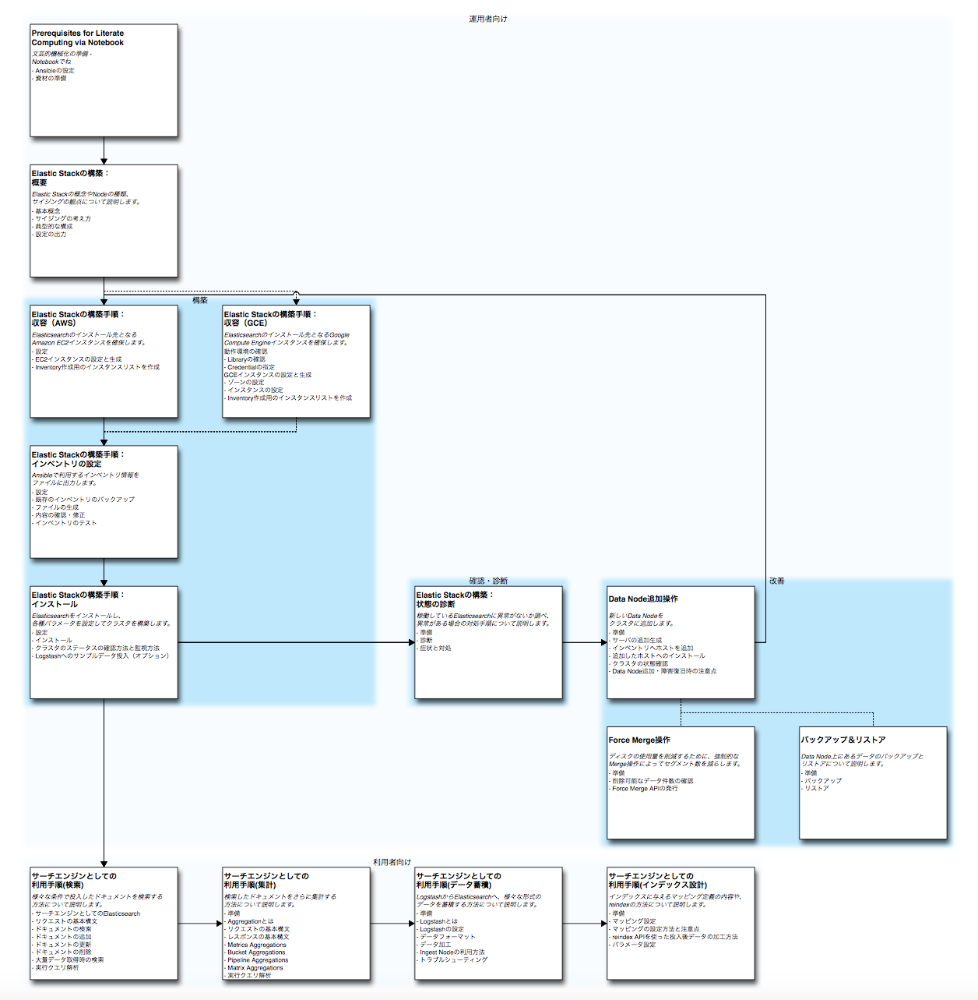

# About: Notebooks for Elasticsearch README

Literate Computing for Reproducible Infrastructure: Elasticsearch運用をJupyter + Ansibleでおこなう際のお手本Notebookです。

このリポジトリでは、Elasticsearch( https://www.elastic.co/jp/products/elasticsearch )の環境を構築し、運用するためのNotebook例を紹介しています。

**このNotebookは、 05_OperationHubをAWSに構築.ipynb によってOperationHub上に配備されることを念頭に構成されています。**

----

[](http://creativecommons.org/licenses/by/4.0/)

Literate-computing-Elasticsearch (c) by National Institute of Informatics

Literate-computing-Elasticsearch is licensed under a
Creative Commons Attribution 4.0 International License.

You should have received a copy of the license along with this
work. If not, see <http://creativecommons.org/licenses/by/4.0/>.

## Elasticsearchとは？
Elasticsearchは、リアルタイムにデータを検索/分析するための分散型の全文検索エンジンであり、次のような特徴を持っています。

1. __リアルタイム分析__  
収集したデータをリアルタイムに検索/分析することができます。  
また、高速に検索できるため、他のBIツールのように事前に分析項目を決めなくても、すでに蓄積されたデータに対してインタラクティブな分析をすることが可能です。

2. __クラスタリングが容易__  
クラスタリングを想定した設計が行われており、他のミドルウェアを利用せずにクラスタを組むことができます。  
ノードを追加することによりスケールアウトできるため、必要な処理性能や可用性などに応じたコントロールが容易です。

3. __ドキュメント指向、スキーマフリー__  
データベースであれば、データをレコードの単位で管理しますが、
Elasticsearchではドキュメントと呼ばれる構造化されたJSONデータの形式で管理します。  
すべてのフィールドはデフォルトでインデックスされるため、簡単かつ高速に検索できます。  
また、このドキュメントはスキーマを決めずに投入することもできるため、すぐに使い始めることができます。  
なお、ログデータのような構造化されていないデータを投入する際には、Logstashなどを用いてJSON形式に加工して保持することになります。

4. __REST API__  
Elasticsearchはシンプルで使いやすいREST APIを提供しています。  
検索処理や登録処理（indexing）だけでなく、インデックスやマッピングの定義、クラスタ管理やメンテナンスなど、Elasticsearchのクラスタ・ノードに対する操作は、ほぼすべてAPIを通じて実施できます。

5. __オープンソース__  
Elasticsearchはオープンソース製品として開発されています。  
ライセンスはApache License Version 2.0です。  
ただし、一部のプラグインを利用するためにはサブスクリプション契約（兼サポート契約）を結ぶ必要があります。

参考）[Elasticsearch公式ページ]( https://www.elastic.co/jp/products )

## 前提条件
このNotebookで前提にしているOS/ミドルウェアのバージョンは次の通りです。

| OS/ミドルウェア | バージョン |
|----|----|
|Elasticserach|elasticsearch-5.0.0-1.noarch|
|Logstash|logstash-5.0.0-1.noarch|
|Ansible|2.2.0.0|
|OS|CentOS Linux release 7.2.1511|
|JDK|jdk1.8.0_112-1.8.0_112-fcs.x86_64|


# お手本Notebook

お手本NotebookはこのNotebookと同じディレクトリにあります。

Notebook名は `XX_(XX_)Notebook名` の形で表現され、Jupyter Notebookのファイル一覧の上でも整理された形で表示できるようにしてあります。

## お手本Notebookの一覧

お手本Notebookとそれぞれの利用局面の関係については、以下のフローを参考にしてください。


```python
from IPython.display import SVG
SVG(filename='images/notebooks-filled.svg')
```




※SVGファイルには各Notebookへのリンクを埋め込んでおります。[notebooks-filled.svg](https://raw.githubusercontent.com/NII-cloud-operation/Literate-computing-Elasticsearch/master/images/notebooks-filled.svg)から参照可能です。


*構築*フェーズは、構築・運用対象とするElasticsearchのためのマシンを準備し、ソフトウェアのインストール、設定を行います。

*確認・診断*フェーズは、構築したElasticsearchの日々の運用や、問題発生時の健康診断を行います。

*改善*フェーズは、健康診断の結果、Nodeの追加により容量を増やしたり、データをクリーンアップしたりといった操作を行います。

## お手本Notebookの目次一覧

各Notebookの詳細な目次を参照するには、以下のセルを実行(`Run cell`)してください。Notebookファイルへのリンクが表示されます。


```python
%run scripts/get-display-contents.py
display_notebook_contents()
```

    /usr/local/lib/python2.7/dist-packages/cffi/model.py:525: UserWarning: 'point_conversion_form_t' has no values explicitly defined; guessing that it is equivalent to 'unsigned int'
      % self._get_c_name())


<div><a href="00_Prerequisites for Literate Computing via Notebooks.ipynb" target="_blank"><b>00_Prerequisites for Literate Computing via Notebooks</b></a><br/><b>About: Prerequisites for Literate Computing via Notebook</b> - 文芸的機械化の準備 - Notebookでね<br/><b>Ansibleの設定</b> - Notebook環境は、以下の条件を満たしている必要がある。<br/>&emsp;・<b>AnsibleでDefault Moduleが利用可能であること - A</b> - DefaultのModuleが使えればよい。特にカスタマイズすべき項目はなし。<br/><b>資材の準備</b> - - Oracle JDK ライセンス認証・RPMパッケージの配置<br/>&emsp;・<b>JVMの資材が準備されていること - A</b> - Elasticsearchを動作させるのに必要なJVMのファイルを用意します。<br/>&emsp;・<b>Elasticsearchのダウンロードサイトにアクセスできること - A</b> - Elasticsearchの媒体を公式サイトからダウンロード可能か確認します。</div><br/><div><a href="01_01_Outline.ipynb" target="_blank"><b>01_01_Outline</b></a><br/><b>Elastic Stackの構築：概要</b> - Elastic Stackの概念やNodeの種類、 サイジングの観点について説明します。<br/>&emsp;・<b>基本概念</b> - 実際の構築の前に、クラスタやそれを構成するNodeに関する基本概念を説明します。<br/>&emsp;・<b>サイジングの考え方</b> - 構築にあたり、1サーバのスペック、設定するshardの数、各役割のノード数を決める必要があります。  <br/>&emsp;・<b>典型的な構成</b> - Elasticsearchを動作させるための典型的な設定を示します。<br/>&emsp;・<b>設定の出力</b> - 前の章の構成例を元に、この後の「収容」「インストール」のNotebookで用いるパラメータを生成します。</div><br/><div><a href="01_02_Accommodation_AWS.ipynb" target="_blank"><b>01_02_Accommodation_AWS</b></a><br/><b>Elastic Stackの構築手順：収容（AWS）</b> - Elasticsearchのインストール先となる Amazon&nbsp;EC2インスタンスを確保します。  <br/>&emsp;・<b>設定</b> - インスタンスの生成に必要な情報を設定します。<br/>&emsp;・<b>EC2インスタンスの設定と生成</b> - サーバ構成に応じたEC2インスタンスの設定を定義し、インスタンスを生成します。<br/>&emsp;・<b>Inventory作成用のインスタンスリストを作成</b> - ホストのパブリックDNS一覧をリスト化します  </div><br/><div><a href="01_02g_Accommodation_GCE.ipynb" target="_blank"><b>01_02g_Accommodation_GCE</b></a><br/><b>Elastic Stackの構築手順：収容（GCE）</b> - Elasticsearchのインストール先となるGoogle Compute&nbsp;Engineインスタンスを確保します。  <br/><b>動作環境の確認</b> - このNotebookは、 [Google Python Client Library](https://github.com/google/google-api-python-client) を使ってマシンの確保を行います。そのため、Libraryがインポート可能であることの確認と、Credentialsが設定されている<br/>&emsp;・<b>Libraryの確認</b> - このNotebook環境にGoogle Python Client Libraryがインストールされている必要があります。インストールされていない場合は、以下のセル実行に失敗し、 ImportError となります。<br/>&emsp;・<b>Credentialの指定</b> - Google Compute EngineにアクセスするためのCredentialを指定してください。<br/><b>GCEインスタンスの設定と生成</b> - サーバ構成に応じたGCEインスタンスの設定を定義し、インスタンスを生成します。<br/>&emsp;・<b>ゾーンの設定</b> - どのZoneにインスタンスを確保するかを定義しておく。<br/>&emsp;・<b>インスタンスの設定</b><br/>&emsp;・<b>Inventory作成用のインスタンスリストを作成</b></div><br/><div><a href="01_03_Set_Inventory.ipynb" target="_blank"><b>01_03_Set_Inventory</b></a><br/><b>Elastic Stackの構築手順：インベントリの設定</b> - Ansibleで利用するインベントリ情報を ファイルに出力します。<br/>&emsp;・<b>設定</b> - アカウントや通信先などを設定します。<br/>&emsp;・<b>既存のインベントリのバックアップ</b> - 出力前に、既存の内容をバックアップ用ディレクトリに退避します。<br/>&emsp;・<b>ファイルの生成</b> - インベントリファイルを生成します。<br/>&emsp;・<b>内容の確認・修正</b> - 生成したインベントリファイルの内容を確認、修正したり、前回のバージョンと比較したい場合は以下から実施できます。<br/>&emsp;・<b>インベントリのテスト</b> - 作成したインベントリにある各ホストに、Ansibleから各種の操作が可能か確認します。</div><br/><div><a href="01_04_Install.ipynb" target="_blank"><b>01_04_Install</b></a><br/><b>Elastic Stackの構築手順：インストール</b> - Elasticsearchをインストールし、 各種パラメータを設定してクラスタを構築します。  <br/>&emsp;・<b>設定</b> - アカウントや通信先などを設定します。<br/>&emsp;・<b>インストール</b> - Elasticsearchのインストールし、設定、起動します。<br/>&emsp;・<b>クラスタのステータスの確認方法と監視方法</b> - クラスタのステータスを確認するためにCluster APIを発行します。<br/>&emsp;・<b>Logstashへのサンプルデータ投入（オプション）</b> - インストール済みのLogstashに、この後のNotebookで利用するサンプルデータを投入します。</div><br/><div><a href="01_05_Diagnostics.ipynb" target="_blank"><b>01_05_Diagnostics</b></a><br/><b>Elastic Stackの構築：状態の診断</b> - 稼働しているElasticsearchに異常がないか調べ、 異常がある場合の対処手順について説明します。<br/>&emsp;・<b>準備</b> - 本章のコマンドを実行するための設定を行います。  <br/>&emsp;・<b>診断</b> - 現在の状態を把握するために、各種の状態を診断します。  <br/>&emsp;・<b>症状と対処</b> - 診断の章で異常があった場合、本章の内容に従い対処します。</div><br/><div><a href="01_50_Add_Data_Node.ipynb" target="_blank"><b>01_50_Add_Data_Node</b></a><br/><b>Data Node追加操作</b> - 新しいData&nbsp;Nodeを クラスタに追加します。<br/>&emsp;・<b>準備</b> - 本章のコマンドを実行するための設定を行います。<br/>&emsp;・<b>サーバの追加生成</b> - Data Nodeを生成する先のサーバを生成します。<br/>&emsp;・<b>インベントリへホストを追加</b> - 追加したホスト情報を既存のインベントリに追記します。<br/>&emsp;・<b>追加したホストへのインストール</b> - 追加したホストに、Elasticsearchをインストールし、設定します。<br/>&emsp;・<b>クラスタの状態確認</b> - クラスタに追加したData Nodeが参加できているか確認します。<br/>&emsp;・<b>Data Node追加・障害復旧時の注意点</b> - Data Nodeを追加したり、一度障害が発生してクラスタから抜けたData Nodeを復旧させる際の注意点について説明します。</div><br/><div><a href="01_51_Force_Merge.ipynb" target="_blank"><b>01_51_Force_Merge</b></a><br/><b>Force Merge操作</b> - ディスクの使用量を削減するために、強制的な Merge操作によってセグメント数を減らします。<br/>&emsp;・<b>準備</b> - 本章のコマンドを実行するための設定を行います。  <br/>&emsp;・<b>削除可能なデータ件数の確認</b> - 削除フラグがonの状態のデータが何件あるか、Indices Statsで確認します。<br/>&emsp;・<b>Force Merge APIの発行</b> - 実際にAPIを発行します。</div><br/><div><a href="01_52_Backup_Restore.ipynb" target="_blank"><b>01_52_Backup_Restore</b></a><br/><b>バックアップ＆リストア</b> - Data&nbsp;Node上にあるデータのバックアップと リストアについて説明します。<br/>&emsp;・<b>準備</b><br/>&emsp;・<b>バックアップ</b> - バックアップ方法について説明します。<br/>&emsp;・<b>リストア</b> - リストア方法について説明します。</div><br/><div><a href="02_Search.ipynb" target="_blank"><b>02_Search</b></a><br/><b>サーチエンジンとしての利用手順(検索)</b> - 様々な条件で投入したドキュメントを検索する 方法について説明します。<br/>&emsp;・<b>サーチエンジンとしてのElasticsearch</b><br/>&emsp;・<b>リクエストの基本構文</b><br/>&emsp;・<b>ドキュメントの検索</b><br/>&emsp;・<b>ドキュメントの追加</b><br/>&emsp;・<b>ドキュメントの更新</b><br/>&emsp;・<b>ドキュメントの削除</b><br/>&emsp;・<b>大量データ取得時の検索</b><br/>&emsp;・<b>実行クエリ解析</b></div><br/><div><a href="03_Aggregation.ipynb" target="_blank"><b>03_Aggregation</b></a><br/><b>サーチエンジンとしての利用手順(集計)</b> - 検索したドキュメントをさらに集計する 方法について説明します。<br/>&emsp;・<b>準備</b><br/>&emsp;・<b>Aggregationとは</b><br/>&emsp;・<b>リクエストの基本構文</b><br/>&emsp;・<b>レスポンスの基本構文</b><br/>&emsp;・<b>Metrics Aggregations</b><br/>&emsp;・<b>Bucket Aggregations</b><br/>&emsp;・<b>Pipeline Aggregations</b><br/>&emsp;・<b>Matrix Aggregations</b><br/>&emsp;・<b>実行クエリ解析</b></div><br/><div><a href="04_Store_Data.ipynb" target="_blank"><b>04_Store_Data</b></a><br/><b>サーチエンジンとしての利用手順(データ蓄積)</b> - LogstashからElasticsearchへ、様々な形式の データを蓄積する方法について説明します。<br/>&emsp;・<b>準備</b><br/>&emsp;・<b>Logstashとは</b><br/>&emsp;・<b>Logstashの設定</b><br/>&emsp;・<b>データフォーマット</b><br/>&emsp;・<b>データ加工</b><br/>&emsp;・<b>Ingest Nodeの利用方法</b><br/>&emsp;・<b>トラブルシューティング</b></div><br/><div><a href="05_Indexing.ipynb" target="_blank"><b>05_Indexing</b></a><br/><b>サーチエンジンとしての利用手順(インデックス設計)</b> - インデックスに与えるマッピング定義の内容や、 reindexの方法について説明します。<br/>&emsp;・<b>準備</b><br/>&emsp;・<b>マッピング設定</b><br/>&emsp;・<b>マッピングの設定方法と注意点</b><br/>&emsp;・<b>reindex APIを使った投入後データの加工方法</b><br/>&emsp;・<b>パラメータ設定</b></div><br/><div><a href="99_Summarizing notebooks.ipynb" target="_blank"><b>99_Summarizing notebooks</b></a><br/><b>About: Notebookの利用フローまとめ</b> - Notebookの利用フローを図としてまとめる例です。<br/><b>必要なツール</b> - このNotebookの実行には[blockdiag](http://blockdiag.com/ja/blockdiag/)が必要です。<br/><b>ブロック図による一覧生成</b> - 以下のセルを実行(`Run All Below`)することで、Notebookがそれぞれどのような局面での利用を想定しているのか、ブロック図で確認することができます。<br/>&emsp;・<b>雛形の生成</b> - まず、Notebookの利用フローを表したブロック図の雛形を作成します。<br/>&emsp;・<b>詳細情報の埋め込み</b> - 生成した雛形に対して、見出しの情報など詳細な情報を埋め込みます。<br/><b>後始末</b> - 一時ファイルを削除します。</div><br/>


## お手本Notebookと証跡Notebook

お手本Notebookを使う場合は、お手本をコピーし、そのコピーを開きます。このように、**お手本と作業証跡は明確に分けながら作業をおこないます。**

また、お手本をコピーする際は、 `YYYYMMDD_NN_` といった実施日を示すプレフィックスを付加することで、後で整理しやすくしています。

## 実際にお手本Notebookを使ってみる

以下のJavaScriptを実行することで、簡単にお手本から作業用Notebookを作成することもできます。

以下のセルを実行すると、Notebook名のドロップダウンリストと[作業開始]ボタンが現れます。
[作業開始]ボタンを押すと、お手本Notebookのコピーを作成した後、自動的にブラウザでコピーが開きます。
Notebookの説明を確認しながら実行、適宜修正しながら実行していってください。


```python
from datetime import datetime
import shutil

def copy_ref_notebook(src):
    prefix = datetime.now().strftime('%Y%m%d') + '_'
    index = len(filter(lambda name: name.startswith(prefix), os.listdir('.'))) + 1
    new_notebook = '{0}{1:0>2}_{2}'.format(prefix, index, src)
    shutil.copyfile(src, new_notebook)
    print(new_notebook)

ref_notebooks = filter(lambda m: m, map(lambda n: re.match(r'([0-9][0-9a-z]+_.*)\.ipynb', n), os.listdir('.')))
ref_notebooks = sorted(ref_notebooks, key=lambda m: m.group(1))

frags = map(lambda m: '<option value="{name}">{title}</option>'.format(name=m.group(0), title=m.group(1)),
            ref_notebooks)
HTML('''
<script type="text/Javascript">
    function copy_otehon() {
        var sel = document.getElementById('selector');
        IPython.notebook.kernel.execute('copy_ref_notebook("' + sel.options[sel.selectedIndex].value + '")',
                       {'iopub': {'output': function(msg) {
                           window.open(msg.content.text, '_blank')
                       }}});
    }
</script>
<select id="selector">''' + ''.join(frags) + '</select><button onclick="copy_otehon()">作業開始</button>')
```


<script type="text/Javascript">
    function copy_otehon() {
        var sel = document.getElementById('selector');
        IPython.notebook.kernel.execute('copy_ref_notebook("' + sel.options[sel.selectedIndex].value + '")',
                       {'iopub': {'output': function(msg) {
                           window.open(msg.content.text, '_blank')
                       }}});
    }
</script>
<select id="selector"><option value="00_Prerequisites for Literate Computing via Notebooks.ipynb">00_Prerequisites for Literate Computing via Notebooks</option><option value="01_01_Outline.ipynb">01_01_Outline</option><option value="01_02_Accommodation_AWS.ipynb">01_02_Accommodation_AWS</option><option value="01_02g_Accommodation_GCE.ipynb">01_02g_Accommodation_GCE</option><option value="01_03_Set_Inventory.ipynb">01_03_Set_Inventory</option><option value="01_04_Install.ipynb">01_04_Install</option><option value="01_05_Diagnostics.ipynb">01_05_Diagnostics</option><option value="01_50_Add_Data_Node.ipynb">01_50_Add_Data_Node</option><option value="01_51_Force_Merge.ipynb">01_51_Force_Merge</option><option value="01_52_Backup_Restore.ipynb">01_52_Backup_Restore</option><option value="02_Search.ipynb">02_Search</option><option value="03_Aggregation.ipynb">03_Aggregation</option><option value="04_Store_Data.ipynb">04_Store_Data</option><option value="05_Indexing.ipynb">05_Indexing</option><option value="99_Summarizing notebooks.ipynb">99_Summarizing notebooks</option></select><button onclick="copy_otehon()">作業開始</button>


## お手本のアーカイブ

以下のセルで、お手本NotebookのZIPアーカイブを作成できます


```python
ref_notebooks = filter(lambda m: m, map(lambda n: re.match(r'([A-Z][0-9][0-9a-z]+_.*)\.ipynb', n), os.listdir('.')))
ref_notebooks = sorted(ref_notebooks, key=lambda m: m.group(1))
!zip ref_notebooks-{datetime.now().strftime('%Y%m%d')}.zip *.ipynb {' '.join(map(lambda n: '"' + n.group(0) + '"', ref_notebooks))} logstash_conf/* playbooks/*.yml sample_data/* images/* scripts/*
```

    updating: 00_Prerequisites for Literate Computing via Notebooks.ipynb (deflated 76%)
    updating: 01_01_Outline.ipynb (deflated 81%)
    updating: 01_02_Accommodation_AWS.ipynb (deflated 85%)
    updating: 01_02g_Accommodation_GCE.ipynb (deflated 86%)
    updating: 01_03_Set_Inventory.ipynb (deflated 86%)
    updating: 01_04_Install.ipynb (deflated 87%)
    updating: 01_05_Diagnostics.ipynb (deflated 89%)
    updating: 01_50_Add_Data_Node.ipynb (deflated 80%)
    updating: 01_51_Force_Merge.ipynb (deflated 95%)
    updating: 01_52_Backup_Restore.ipynb (deflated 86%)
    updating: 02_Search.ipynb (deflated 92%)
    updating: 03_Aggregation.ipynb (deflated 94%)
    updating: 04_Store_Data.ipynb (deflated 88%)
    updating: 05_Indexing.ipynb (deflated 90%)
    updating: 99_Summarizing notebooks.ipynb (deflated 89%)
    updating: Delete_01_06_Manual-Operation.ipynb (deflated 94%)
    updating: Delete_01_07_Troubleshooting.ipynb (deflated 88%)
    updating: Readme.ipynb (deflated 84%)
    updating: logstash_conf/csv.conf (deflated 53%)
    updating: logstash_conf/document_id.conf (deflated 54%)
    updating: logstash_conf/geoip.conf (deflated 45%)
    updating: logstash_conf/json.conf (deflated 30%)
    updating: logstash_conf/json_multiline.conf (deflated 41%)
    updating: logstash_conf/ltsv.conf (deflated 81%)
    updating: logstash_conf/main.conf (deflated 53%)
    updating: logstash_conf/multi_line.conf (deflated 77%)
    updating: logstash_conf/single_line.conf (deflated 78%)
    updating: logstash_conf/tsv.conf (deflated 53%)
    updating: logstash_conf/useragent.conf (deflated 36%)
    updating: playbooks/copy_logstash_conf.yml (deflated 35%)
    updating: playbooks/copy_sample_data.yml (deflated 28%)
    updating: playbooks/install_elasticsearch.yml (deflated 36%)
    updating: playbooks/install_jdk.yml (deflated 52%)
    updating: playbooks/install_logstash.yml (deflated 34%)
    updating: playbooks/set_api_parameter.yml (deflated 37%)
    updating: playbooks/set_elasticsearch.yml (deflated 74%)
    updating: playbooks/set_heap-size.yml (deflated 54%)
    updating: playbooks/set_iptables-rule.yml (deflated 57%)
    updating: playbooks/set_kernelparameter.yml (deflated 39%)
    updating: playbooks/set_test.yml (deflated 35%)
    updating: playbooks/start_cluster.yml (deflated 33%)
    updating: sample_data/geoip.csv (deflated 79%)
    updating: sample_data/geoip.json (deflated 79%)
    updating: sample_data/mapping.txt (deflated 76%)
    updating: sample_data/multi_line.txt (deflated 61%)
    updating: sample_data/single_line.txt (deflated 43%)
    updating: sample_data/tokyo2015.csv (deflated 74%)
    updating: sample_data/useragent.txt (deflated 38%)
    updating: sample_data/weather.csv (deflated 62%)
    updating: sample_data/weather.json (deflated 89%)
    updating: sample_data/weather.ltsv (deflated 50%)
    updating: sample_data/weather.tsv (deflated 62%)
    updating: sample_data/weather_multiline.json (deflated 89%)
    updating: images/01_1server.png (deflated 10%)
    updating: images/01_5server.png (deflated 23%)
    updating: images/01_basic_concept.png (deflated 17%)
    updating: images/01_node_type.png (deflated 7%)
    updating: images/01_server_construction.png (deflated 10%)
    updating: images/03_pipeline.png (deflated 16%)
    updating: images/images.pptx (deflated 19%)
    updating: images/notebooks-filled.svg (deflated 90%)
      adding: scripts/generate-diagram.py (deflated 73%)
      adding: scripts/get-display-contents.py (deflated 49%)
      adding: scripts/get-json-repr.py (deflated 46%)
      adding: scripts/get-replace-file.py (deflated 52%)
      adding: scripts/get-struct-selector.py (deflated 61%)


```python

```
