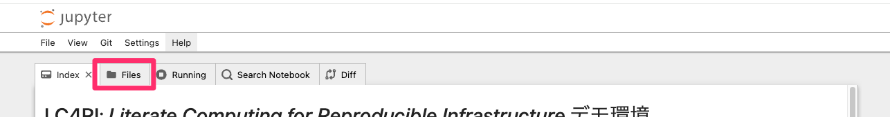

# LC4RI: *Literate Computing for Reproducible Infrastructure* デモ環境

Literate Computing for Reproducible Infrastructure（以下「LC4RI」）は、**インフラ運用チームの生産性向上**を目的として、作業をできる限り**記録・実行可能なかたちで残す**ことで、**ノウハウ共有と機械化の双方を実現しよう**という取り組みです。

多くの現場では、管理サーバにログインしコンソール上で作業を行う、作業内容や証跡はWiki等に随時転記して共有する.. といった形態が一般的と思います。これに対しLC4RIでは運用管理サーバ上にJupyter Notebookサーバを配備し、作業単位毎にNotebookを作成、作業内容やメモを記述しながら随時実行するといった作業形態を推奨しています。作業の証跡をNotebookとして齟齬なく記録することができるため機械的に再実行しやすく、かつその作業に至る経緯などの記述も同時に表現することができるため、他のメンバーが読み解ける状態にすることも容易です。
作業を効率化しつつもブラックボックス化せず、作業に対する理解をチーム内でコミュニケーションできる、また、目的と手段の整合性や限界を理解し議論・評価できると言った場を維持することで、ノウハウの移転・共有を促し運用者のスキル向上とエンジニアリングチームの再生産をはかることを重視しています。このように、過度に自動化に依存することのない、レジリエントな **人間中心の機械化** をめざしています。

## デモ環境の利用方法

このデモ環境ではJupyterのインタフェースを使って、運用作業の一例としてのログ分析や、我々のチームがLC4RIの実践のために開発している各種Extensionを使ってみるといった体験ができます。
Notebookを参照するには、 Files タブを参照してください。

(mybinder.orgからアクセスしている場合) なお、この環境ではNotebookを自由に作成、編集することができますが、Notebookに対する変更等は、 **保存されません** 。この環境は[Binder](https://mybinder.readthedocs.io/en/latest/)サービスの上でデプロイされており、一定時間が経過すると自動的に削除されます。編集したNotebookなどの情報は失われますのでご注意ください。

また、Sidestickies という Notebookに対して Sticky Note（付箋）を付与する機能では [ep_weave](https://github.com/NII-cloud-operation/ep_weave/)を利用しています。デモ環境の Sticky Note は、この環境内で起動したep_weaveサービスによって保存されます。このため、Sticky Note はこの環境内でのみ有効であり、永続化されない点にご注意ください。

>  **デモ環境を体験するに際して、 [Binder](https://mybinder.readthedocs.io/en/latest/) の利用規約は各自で確認ください。** 

 質問等、お問い合わせは、Facebookページ https://www.facebook.com/groups/792904597583420/ に参加申請ください！

## Notebookの実行方法

このデモ環境では、Notebookという形式で、実際に自身で実行可能な運用作業の例が保存されています。

[00_デモ環境の利用方法](00_デモ環境の利用方法.ipynb)を参考に、実際に実行をしてみてください。

## Literate Computingの運用への適用例

運用への適用例の一つとして、ログを分析する手順を記述したNotebookを体感いただけます。

* [01_Literate_Computingの運用への適用例](01_Literate_Computingの運用への適用例.ipynb)

## NII謹製Literate Computing機能拡張
Jupyterはもともとデータ分析用途に開発されたツールであるため、インフラの運用に適用するためにいくつかの機能拡張を施しています。以下は、その内容をご紹介するNotebookです。

* [02_NII謹製_Jupyterの機能拡張について](02_NII謹製_Jupyterの機能拡張について.ipynb)

## Notebookを介したコミュニケーション

Jupyterで行った経験を効率的に共有するためにいくつかの機能拡張を施しています。以下は、その内容をご紹介するNotebookです。

* [03_Notebookを介したコミュニケーション](03_Notebookを介したコミュニケーション.ipynb)

## Notebookの検索

Jupyterで実施したNotebookを効率的に検索するための機能拡張を施しています。以下は、その内容をご紹介するNotebookです。

* [04_Notebookの検索](04_Notebookの検索.ipynb)

## OperationHub

Jupyter Notebookを用いた運用手順を複数人で効果的に共有・管理するために、JupyterHubを拡張したOperationHubを提供しています。
以下は、OperationHubをAWSアカウント内に構築し、試用するためのNotebookです。

> AWSへのアカウント登録が必要です。また、仮想マシン等の維持には一定の料金がかかります。ご自身の責任でお試しください。

* [05_OperationHubをAWSに構築](05_OperationHubをAWSに構築.ipynb)
